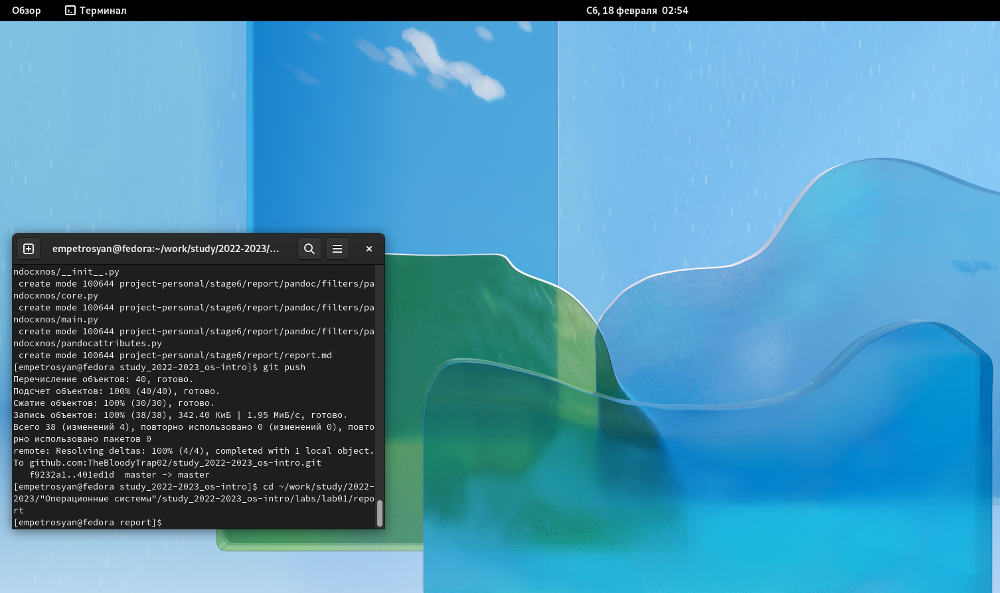
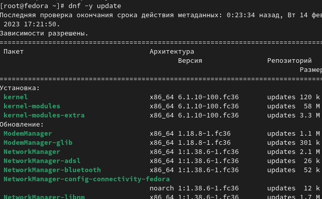
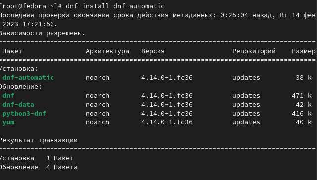
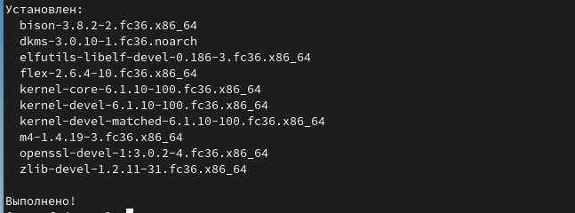
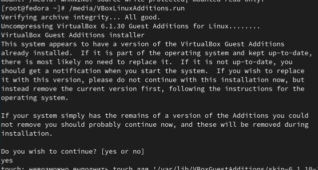
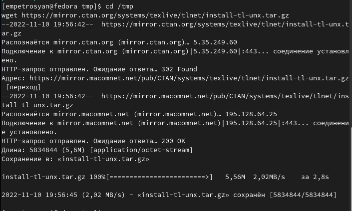
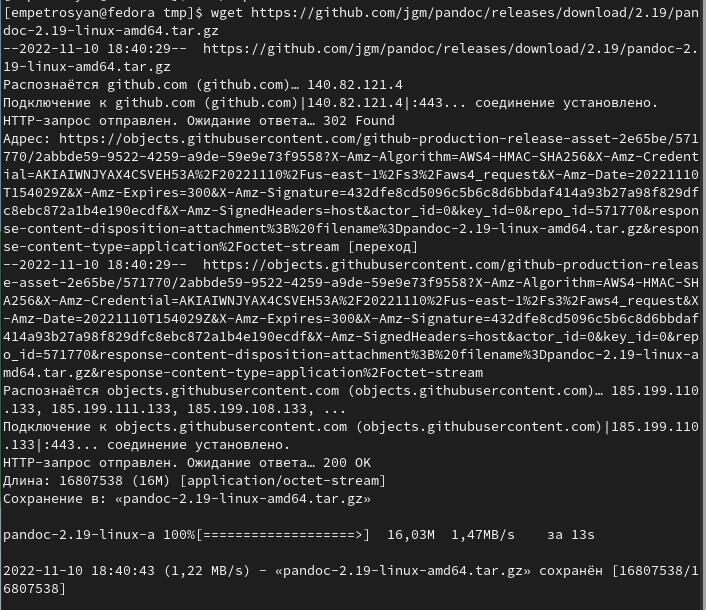
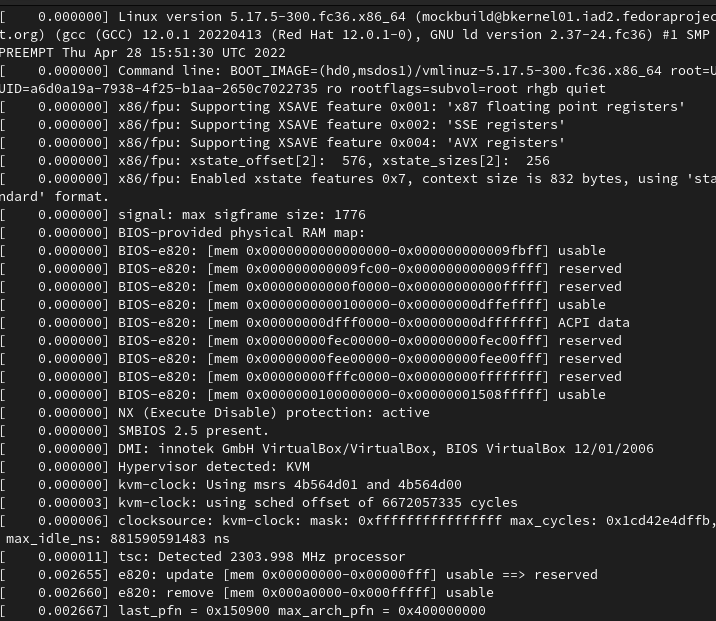
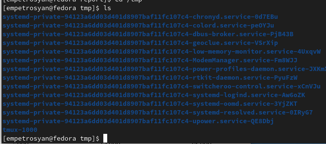
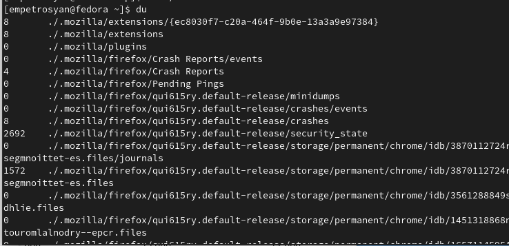

---
## Front matter
lang: ru-RU
title: Установка ОС Linux
subtitle: Лабораторная работа №1
author: Петросян Э. М.
  - 
institute:
  - Российский университет дружбы народов, Москва, Россия
date: 16 февраля 2023

## i18n babel
babel-lang: russian
babel-otherlangs: english

## Formatting pdf
toc: false
toc-title: Содержание
slide_level: 2
aspectratio: 169
section-titles: true
theme: metropolis
header-includes:
 - \metroset{progressbar=frametitle,sectionpage=progressbar,numbering=fraction}
 - '\makeatletter'
 - '\beamer@ignorenonframefalse'
 - '\makeatother'
backgroundColor: orange
---

# Информация

## Докладчик

:::::::::::::: {.columns align=center}
::: {.column width="60%"}

  * Петросян Эмиль Манукович
  * студент 1 курса, группа НММбд-03-22
  * Российский университет дружбы народов

:::
::: {.column width="40%"}

:::
::::::::::::::

# Вводная часть

## Объект и предмет исследования

- Виртуальная машина VirtualBox
- Операционная система Linux 

## Цели работы

- Приобретение практических навыков установки операционной системы на виртуальную машину
- Настройки минимально необходимых для дальнейшей работы сервисов

## Задание
1. Установить на виртуальную машину VirtualBox операционной системы Linux 
(дистрибутив Fedora).
2. Запустить установленную в VirtualBox ОС
3. Выполнить практические задания по теме лабораторной
4. Ответить на теоритические вопросы

# Выполнение лабораторной работы №1

## Настройка VirtualBox и установка системы

:::::::::::::: {.columns align=center}

::: {.column width="50%"}

- Своя техника
- Образ операционной системы
- Тип операционной системы – Linux, Fedora
- Размер основной памяти VM – от 2048 МБ 
- Объем видеопамяти до 128 МБ
- Выбор образа ОС

:::

::: {.column width="50%"}

:::

::::::::::::::

## После установки

:::::::::::::: {.columns align=center}

::: {.column width="30%"}

:::

::: {.column width="30%"}

:::

::: {.column width="30%"}

:::
::::::::::::::

## После установки

:::::::::::::: {.columns align=center}

::: {.column width="30%"}

:::

::: {.column width="30%"}

:::

::: {.column width="30%"}

:::
::::::::::::::

## После установки

:::::::::::::: {.columns align=center}

::: {.column width="30%"}

:::

::: {.column width="30%"}

:::

::: {.column width="30%"}

:::
::::::::::::::

## Установка программного обеспечения для создания документации

:::::::::::::: {.columns align=center}

::: {.column width="30%"}

- TeX Live
- Pandoc
- Pandoc-crossref

:::

::: {.column width="30%"}

:::

::: {.column width="30%"}

:::
::::::::::::::

## Выполнение практического задания

:::::::::::::: {.columns align=center}

::: {.column width="50%"}

- Версия ядра Linux (Linux version).
- Частота процессора (Detected Mhz processor).
- Модель процессора (CPU0).
- Объём доступной оперативной памяти (Memory available).
- Тип обнаруженного гипервизора (Hypervisor detected).
- Тип файловой системы корневого раздела.
- Последовательность монтирования файловых систем.

:::

::: {.column width="50%"}

:::
::::::::::::::

## Ответы на контрольные вопросы

:::::::::::::: {.columns align=center}

::: {.column width="30%"}

:::

::: {.column width="30%"}

:::

::: {.column width="30%"}

:::
::::::::::::::

# Результаты

## Выводы из лабораторной работы №1

 - В ходе выполнения данной лабораторной работы были приобретены практические навыков установки операционной системы на виртуальную машину, настройки минимально необходимых для дальнейшей работы сервисов.
 - Были изучены теоритические аспекты работы с виртуальной машиной

