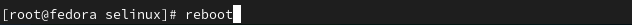
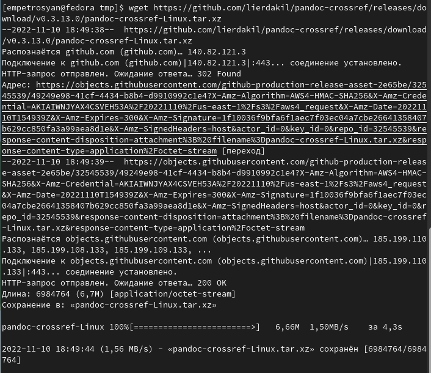
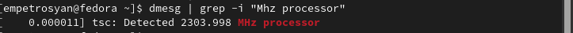

---
## Front matter
title: "Отчёт по лабораторной работе № 1"
subtitle: "Операционные системы"
author: "Петросян Эмиль Манукович"

## Generic otions
lang: ru-RU
toc-title: "Содержание"

## Bibliography
bibliography: bib/cite.bib
csl: pandoc/csl/gost-r-7-0-5-2008-numeric.csl

## Pdf output format
toc: true # Table of contents
toc-depth: 2
lof: true # List of figures
fontsize: 12pt
linestretch: 1.5
papersize: a4
documentclass: scrreprt
## I18n polyglossia
polyglossia-lang:
  name: russian
  options:
	- spelling=modern
	- babelshorthands=true
polyglossia-otherlangs:
  name: english
## I18n babel
babel-lang: russian
babel-otherlangs: english
## Fonts
mainfont: PT Serif
romanfont: PT Serif
sansfont: PT Sans
monofont: PT Mono
mainfontoptions: Ligatures=TeX
romanfontoptions: Ligatures=TeX
sansfontoptions: Ligatures=TeX,Scale=MatchLowercase
monofontoptions: Scale=MatchLowercase,Scale=0.9
## Biblatex
biblatex: true
biblio-style: "gost-numeric"
biblatexoptions:
  - parentracker=true
  - backend=biber
  - hyperref=auto
  - language=auto
  - autolang=other*
  - citestyle=gost-numeric
## Pandoc-crossref LaTeX customization
figureTitle: "Рис."
tableTitle: "Таблица"
listingTitle: "Листинг"
lofTitle: "Список иллюстраций"
lolTitle: "Листинги"
## Misc options
indent: true
header-includes:
  - \usepackage{indentfirst}
  - \usepackage{float} # keep figures where there are in the text
  - \floatplacement{figure}{H} # keep figures where there are in the text
---

# Цель работы
Целью данной работы является приобретение практических навыков установки операционной системы на виртуальную машину, настройки минимально необходимых для дальнейшей работы сервисов.

# Задание
1. Установить на виртуальную машину VirtualBox операционной системы Linux 
(дистрибутив Fedora).
2. Запустить установленную в VirtualBox ОС

# Выполнение лабораторной работы

## Запуск VirtualBox и настройка ОС

Создание и первичная настройка виртуальной машины было выполнено в лабораторной работе предыдущего семестра.
Демонстрация работающей виртуальной машины с названием соответствующим согласию об именовании. (рис. [-@fig:000])

{ #fig:000 width=70%}

## После установки

Вошли в ОС под заданной при установке учётной записью.
Выполнили запуск терминала.
Переключились на роль супер-пользователя: (рис. [-@fig:001])

{ #fig:001 width=70%}

Обновили все пакеты. (рис. [-@fig:002])

{ #fig:002 width=70%}

Установили программы для удобства работы в консоли: (рис. [-@fig:003])

{ #fig:003 width=70%}

Установили программное обеспечение для автоматического обновления. (рис. [-@fig:004])

{ #fig:004 width=70%}

Задали необходимую конфигурацию в файле automatic.conf.
Запустили таймер: (рис. [-@fig:005])

{ #fig:005 width=70%}

Отключили selinux.В файле config замените значение enforcing на значение permissive. (рис. [-@fig:006])
Перегрузили виртуальную машину: (рис. [-@fig:007])

{ #fig:006 width=70%}

{ #fig:007 width=70%}

Вошли в ОС под заданной при установке учётной записью. Запустили терминал.
Запустили терминальный мультиплексор tmux: (рис. [-@fig:008])

{ #fig:008 width=70%}

Переключились на роль супер-пользователя: (рис. [-@fig:009])

{ #fig:009 width=70%}

Установили пакет DKMS: (рис. [-@fig:010])

{ #fig:010 width=70%}

В меню виртуальной машины подключили образ диска дополнений гостевой ОС и подмонтировали диск: (рис. [-@fig:011])

{ #fig:011 width=70%}

Установили драйвера: (рис. [-@fig:012])

{ #fig:012 width=70%}

Перегрузили виртуальную машину (рис. [-@fig:013])

{ #fig:013 width=70%}

Вошли в ОС под заданной при установке учётной записью. Запустили терминал.
Запустили терминальный мультиплексор tmux: (рис. [-@fig:014])

{ #fig:014 width=70%}

Переключились на роль супер-пользователя: (рис. [-@fig:015])

{ #fig:015 width=70%}

Отредактировали конфигурационный файл 00-keyboard.conf: (рис. [-@fig:016])
Для этого можно использовали файловый менеджер mc и его встроенный редактор.
Перегрузили виртуальную машину. (рис. [-@fig:017])

{ #fig:016 width=70%}

{ #fig:017 width=70%}

## Установка программного обеспечения для создания документации

На странице официального сайта TeX Live скачали архив install-tl-unx.tar.gz. (рис. [-@fig:018])

{ #fig:018 width=70%}

Распаковали архив. (рис. [-@fig:019])

{ #fig:019 width=70%}

Перешли в распакованную папку (рис. [-@fig:020])

{ #fig:020 width=70%}

Запустили скрипт install-tl c root правами. (рис. [-@fig:021])

{ #fig:021 width=70%}

Добавили в PATH для текущей и будущих 
сессий. (рис. [-@fig:022])

{ #fig:022 width=70%}

Скачали архивы с исходными файлами pandoc (рис. [-@fig:023])

{ #fig:023 width=70%}

Скачать архив pandoc-crossref (рис. [-@fig:024])

{ #fig:024 width=70%}

Распаковали архивы (рис. [-@fig:025])

{ #fig:025 width=70%}

Скопировали файлы pandoc и pandoc-crossref в каталог. С помощью команды ls можно проверили корректность выполненных действий (рис. [-@fig:026])

{ #fig:026 width=70%}

## Домашнее задание

Дождались загрузки графического окружения и открыли терминал. 
В окне терминала проросмотреть вывод, выполнив команду dmesg. (рис. [-@fig:027])

{ #fig:027 width=70%}

Получили следующую информацию.
1. Версия ядра Linux (Linux version). (рис. [-@fig:028])
2. Частота процессора (Detected Mhz processor). (рис. [-@fig:029])
3. Модель процессора (CPU0). (рис. [-@fig:030])
4. Объём доступной оперативной памяти (Memory available). (рис. [-@fig:031])
5. Тип обнаруженного гипервизора (Hypervisor detected). (рис. [-@fig:032])
6. Тип файловой системы корневого раздела. (рис. [-@fig:033])
7. Последовательность монтирования файловых систем. (рис. [-@fig:034])

{ #fig:028 width=70%}

{ #fig:029 width=70%}

{ #fig:030 width=70%}

{ #fig:031 width=70%}

{ #fig:032 width=70%}

{ #fig:033 width=70%}

{ #fig:034 width=70%}

# Выводы

В ходе выполнения данной лабораторной работы были приобретены практические навыков установки операционной системы на виртуальную машину, настройки минимально необходимых для дальнейшей работы сервисов.

# Ответы на контрольные вопросы
1. Какую информацию содержит учётная запись пользователя?
	User ID - логин;
	Password – наличие пароля;
	UID - идентификатор пользователя;
	GID - идентификатор группы по умолчанию;
	User Info – вспомогательная информация о пользователе (полное имя, контакты и т.д.)
	Home Dir - начальный (он же домашний) каталог;
	Shell - регистрационная оболочка, или shell
2. Укажите команды терминала и приведите примеры:
	для получения справки по команде; help (рис. [-@fig:035])
	
	{ #fig:035 width=70%}
	
	для перемещения по файловой системе; cd (рис. [-@fig:036])
	
	{ #fig:036 width=70%}
	
	для просмотра содержимого каталога; ls (рис. [-@fig:037])
	
	{ #fig:037 width=70%}
	
	для определения объёма каталога; du (рис. [-@fig:038])
	
	{ #fig:038 width=70%}
	
	для создания, удаления каталогов, файлов; 
	touch - создать пустой файл. (рис. [-@fig:039])
	
	{ #fig:039 width=70%}
	
	mkdir - создать папку; (рис. [-@fig:040])
	
	{ #fig:040 width=70%}
	
	rm - удалить файл; (рис. [-@fig:041])
	
	{ #fig:041 width=70%}
	
	rmdir - удалить папку; (рис. [-@fig:042])
	
	{ #fig:042 width=70%}
	
	для задания определённых прав на файл, каталог; chmod (рис. [-@fig:043])
	
	{ #fig:043 width=70%}
	
	для просмотра истории команд. history (рис. [-@fig:044])
	
	{ #fig:044 width=70%}
	
3. Что такое файловая система? Приведите примеры с краткой характеристикой.
	Файловая система Linux представляет собой встроенный уровень
	 операционной системы Linux, используемый для управления данными хранилища.
	 Он контролирует, как данные хранятся и извлекаются. Он управляет именем
	 файла, размером файла, датой создания и другой информацией о файле.

	ФАЙЛОВАЯ СИСТЕМА EXT4 - Ext4 была представлена в 2008 году и является
	 файловой системой Linux по умолчанию с 2010 года. Она была разработана
	 как прогрессивная версия файловой системы ext3 и преодолевает ряд 
	ограничений в ext3. Она имеет значительные преимущества перед своим
	 предшественником, такие как улучшенный дизайн, лучшая производительность,
	 надежность и новые функции.

	XFS - это высокомасштабируемая файловая система, разработанная Silicon
	 Graphics и впервые развернутая в операционной системе IRIX на базе Unix
	 в 1994 году. Это файловая система с журналированием которая отслеживает
	 изменения в журнале перед фиксацией изменений в основной файловой системе.
	 Преимущество заключается в гарантированной целостности файловой системы
	 и ускоренном восстановлении в случае сбоев питания или сбоев системы.

4. Как посмотреть, какие файловые системы подмонтированы в ОС?
	Чтобы посмотреть какие файловые системы уже смонтированы в системе можно
	 выполнить команду mount без параметров или выполнить команду df -a. Также
	 можно посмотреть содержимое файла etc/mtab. 

5. Как удалить зависший процесс?
	Для передачи сигналов процессам в Linux используется утилита kill. Ее
	 синтаксис очень прост:
	$ kill -сигнал pid_процесса
	
	
	
