---
## Front matter
title: "Отчёт по лабораторной работе № 9"
subtitle: "Текстовой редактор emacs"
author: "Петросян Эмиль Манукович"

## Generic otions
lang: ru-RU
toc-title: "Содержание"

## Bibliography
bibliography: bib/cite.bib
csl: pandoc/csl/gost-r-7-0-5-2008-numeric.csl

## Pdf output format
toc: true # Table of contents
toc-depth: 2
lof: true # List of figures
fontsize: 12pt
linestretch: 1.5
papersize: a4
documentclass: scrreprt
## I18n polyglossia
polyglossia-lang:
  name: russian
  options:
	- spelling=modern
	- babelshorthands=true
polyglossia-otherlangs:
  name: english
## I18n babel
babel-lang: russian
babel-otherlangs: english
## Fonts
mainfont: PT Serif
romanfont: PT Serif
sansfont: PT Sans
monofont: PT Mono
mainfontoptions: Ligatures=TeX
romanfontoptions: Ligatures=TeX
sansfontoptions: Ligatures=TeX,Scale=MatchLowercase
monofontoptions: Scale=MatchLowercase,Scale=0.9
## Biblatex
biblatex: true
biblio-style: "gost-numeric"
biblatexoptions:
  - parentracker=true
  - backend=biber
  - hyperref=auto
  - language=auto
  - autolang=other*
  - citestyle=gost-numeric
## Pandoc-crossref LaTeX customization
figureTitle: "Рис."
tableTitle: "Таблица"
listingTitle: "Листинг"
lofTitle: "Список иллюстраций"
lolTitle: "Листинги"
## Misc options
indent: true
header-includes:
  - \usepackage{indentfirst}
  - \usepackage{float} # keep figures where there are in the text
  - \floatplacement{figure}{H} # keep figures where there are in the text
---

# Цель работы
Познакомиться с операционной системой Linux. Получить практические навыки работы с редактором Emacs.

# Задание
- Ознакомиться с теоретическим материалом.
- Ознакомиться с редактором emacs.
- Выполнить упражнения.
- Ответить на контрольные вопросы.

# Выполнение лабораторной работы

## Основные команды emacs

1. Открыли emacs. (рис. [-@fig:001])б (рис. [-@fig:002])

{ #fig:001 width=70%}

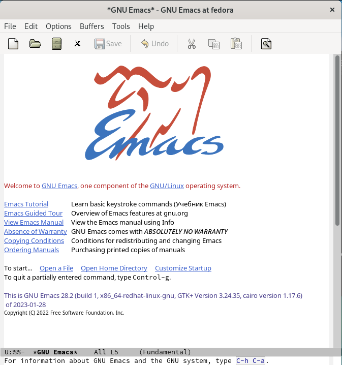{ #fig:002 width=70%}

2. Создали файл lab07.sh с помощью комбинации Ctrl-x Ctrl-f (C-x C-f). (рис. [-@fig:003])

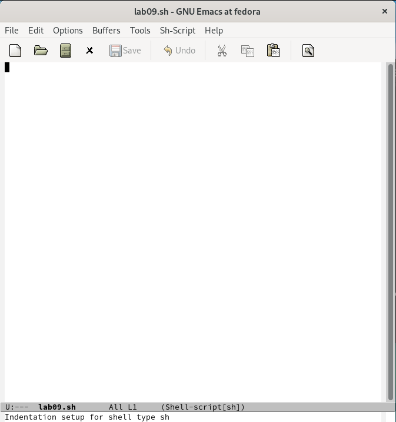{ #fig:003 width=70%}

3. Набрали текст: (рис. [-@fig:004])

{ #fig:004 width=70%}

4. Сохранили файл с помощью комбинации Ctrl-x Ctrl-s (C-x C-s). (рис. [-@fig:005])

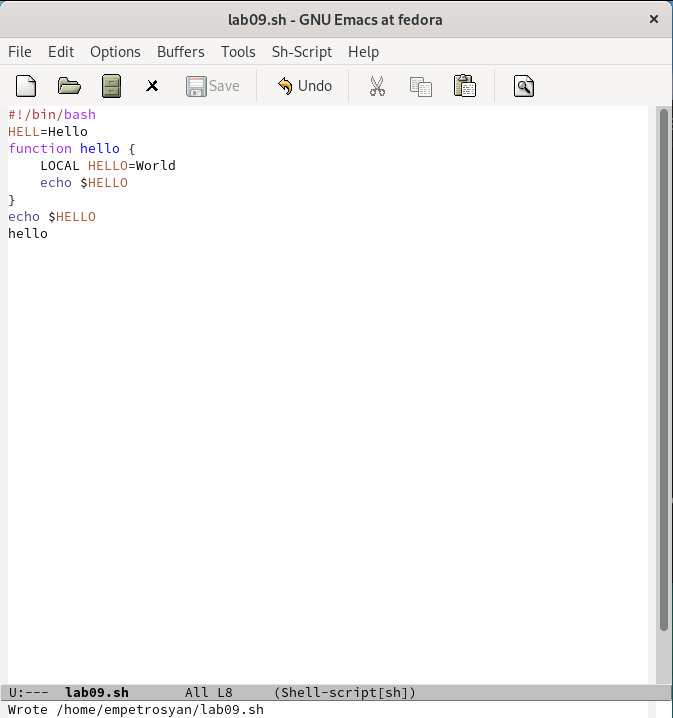{ #fig:005 width=70%}

5. Проделали с текстом стандартные процедуры редактирования, каждое действие осуществили комбинацией клавиш.
	Вырезали одной командой целую строку (С-k). (рис. [-@fig:006])
	
	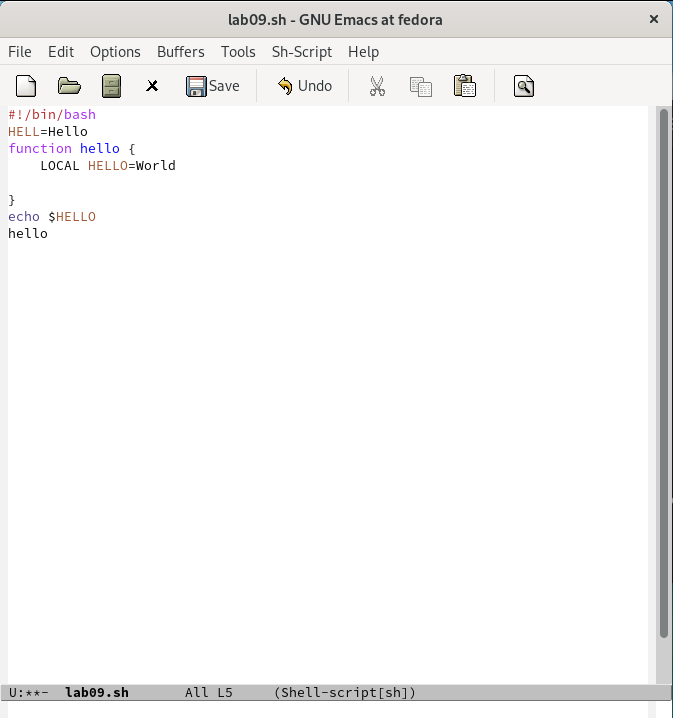{ #fig:006 width=70%}
	
	Вставили эту строку в конец файла (C-y). (рис. [-@fig:007])
	
	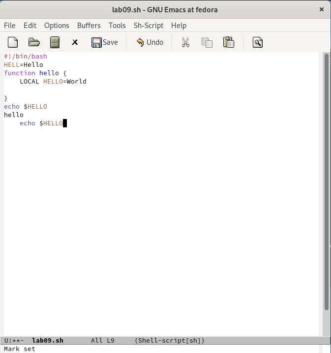{ #fig:007 width=70%}
	
	Выделили область текста (C-space).(рис. [-@fig:008])
	
	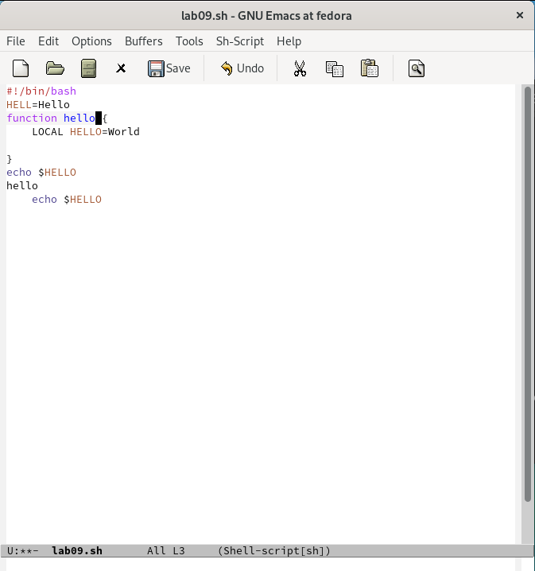{ #fig:008 width=70%}
	
	Скопировали область в буфер обмена (M-w). (рис. [-@fig:009])
	
	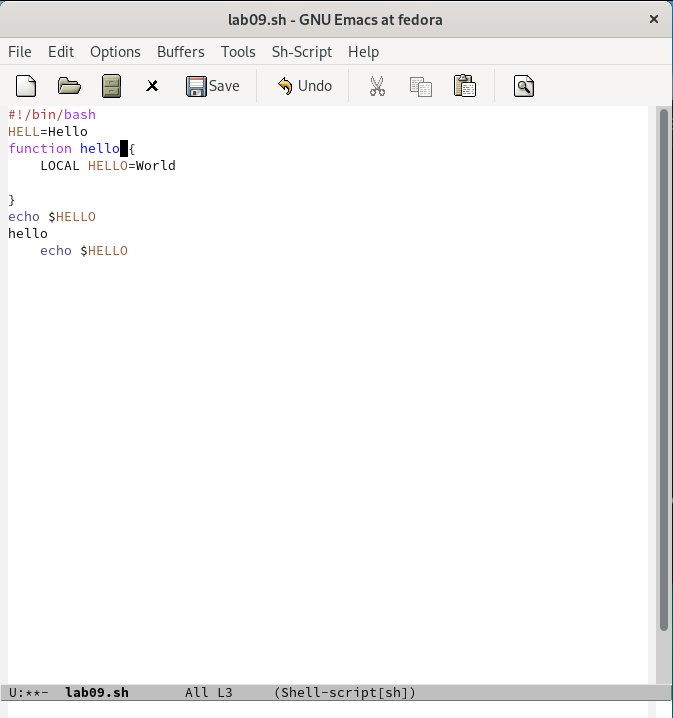{ #fig:009 width=70%}
	
	Вставили область в конец файла. (рис. [-@fig:010])
	
	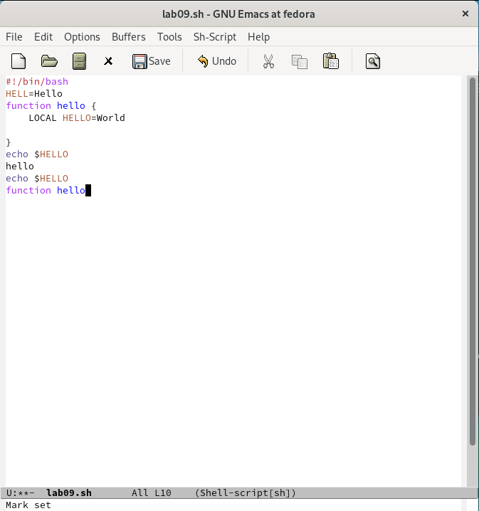{ #fig:010 width=70%}
	
	Вновь выделили эту область и на этот раз вырезали её (C-w). (рис. [-@fig:011]), (рис. [-@fig:012])
	
	{ #fig:011 width=70%}
	
	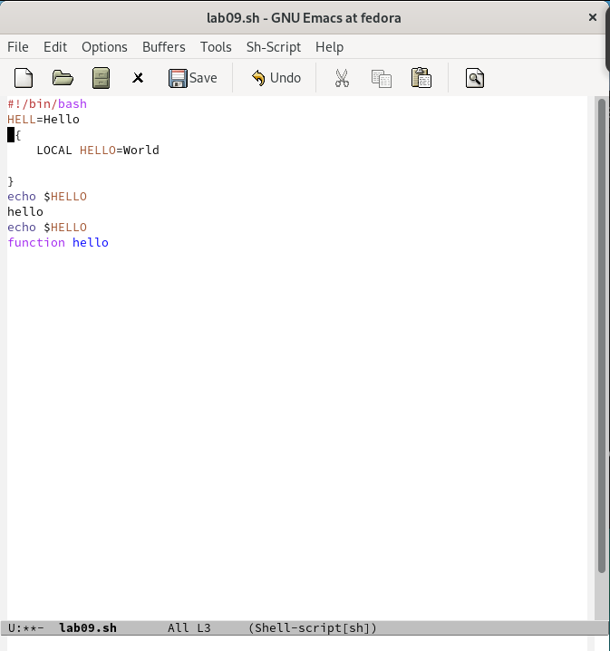{ #fig:012 width=70%}
	
	Отменили последнее действие (C-/). (рис. [-@fig:013])
	
	{ #fig:013 width=70%}
	
6. Научились использовать команды по перемещению курсора.
	Переместили курсор в начало строки (C-a). (рис. [-@fig:014])
	
	{ #fig:014 width=70%}
	
	Переместили курсор в конец строки (C-e). (рис. [-@fig:015])
	
	{ #fig:015 width=70%}
	
	Переместили курсор в начало буфера (M-<). (рис. [-@fig:016])
	
	{ #fig:016 width=70%}
	
	Переместили курсор в конец буфера (M->). (рис. [-@fig:017])
	
	{ #fig:017 width=70%}
	
7. Управление буферами.
	Вывели список активных буферов на экран (C-x C-b). (рис. [-@fig:018])
	
	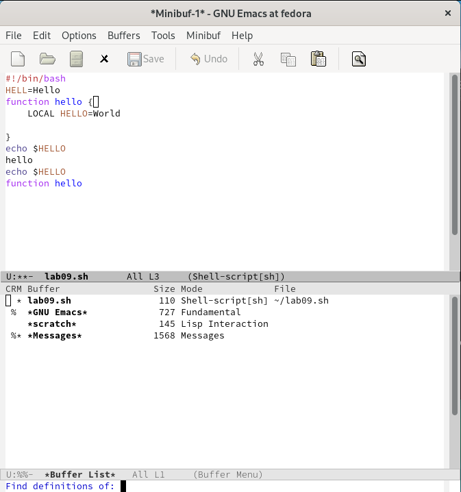{ #fig:018 width=70%}
	
	Переместились во вновь открытое окно (C-x) o со списком открытых буферов и переключились на другой буфер. (рис. [-@fig:019]), (рис. [-@fig:020])
	
	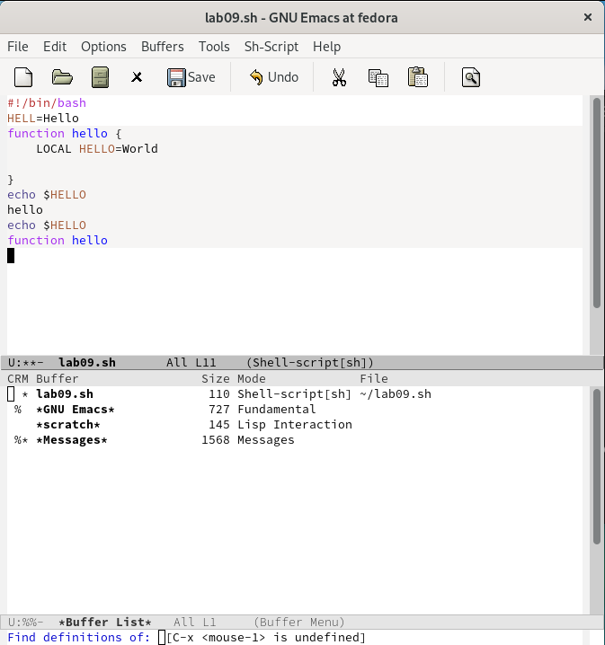{ #fig:019 width=70%}
	
	{ #fig:020 width=70%}
	
	Закрыли это окно (C-x 0). (рис. [-@fig:021])
	
	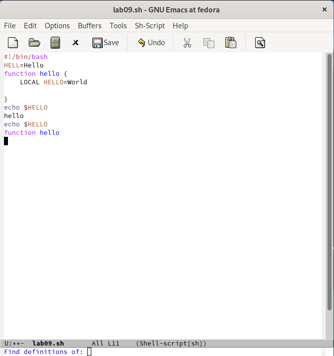{ #fig:021 width=70%}
	
	Теперь вновь переключились между буферами, но уже без вывода их списка на экран (C-x b). (рис. [-@fig:022])
	
	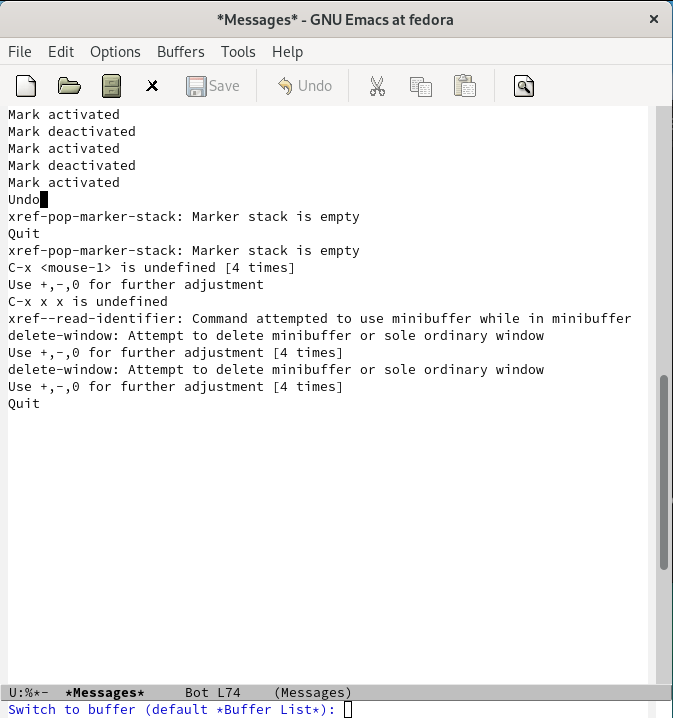{ #fig:022 width=70%}
	
8. Управление окнами.
	Поделили фрейм на 4 части: разделили фрейм на два окна по вертикали (C-x 3), а затем каждое из этих окон на две части по горизонтали (C-x 2) (см. рис. 9.1). (рис. [-@fig:023])
	
	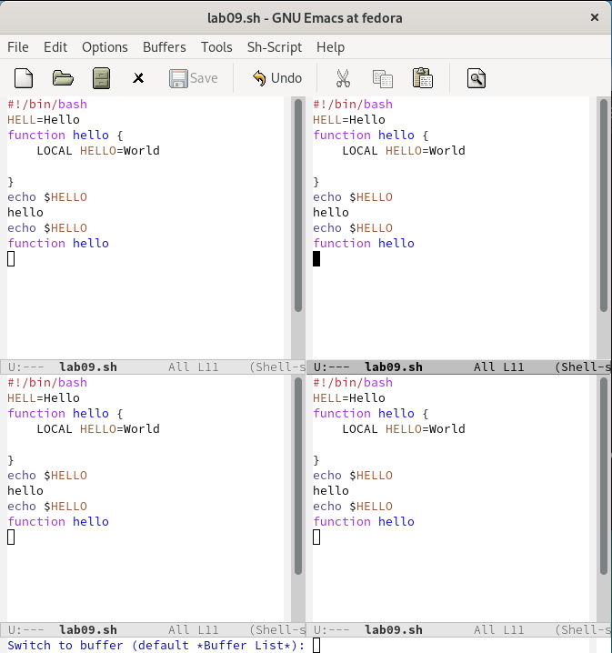{ #fig:023 width=70%}
	
	В каждом из четырёх созданных окон открыли новый буфер (файл) и ввели несколько строк текста. (рис. [-@fig:024])
	
	{ #fig:024 width=70%}
	
9. Режим поиска
	Переключились в режим поиска (C-s) и нашли несколько слов, присутствующих
	в тексте. (рис. [-@fig:025])
	
	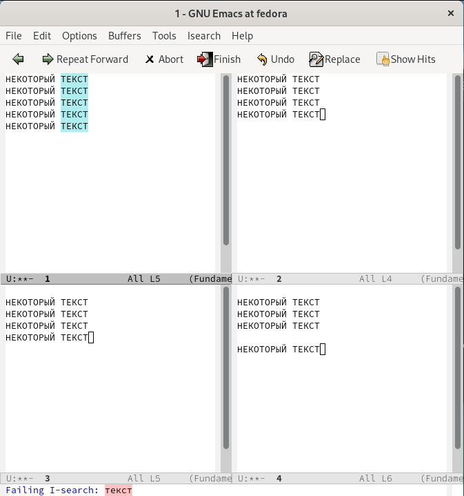{ #fig:025 width=70%}
	
	Переключились между результатами поиска, нажимая C-s. (рис. [-@fig:026])
	
	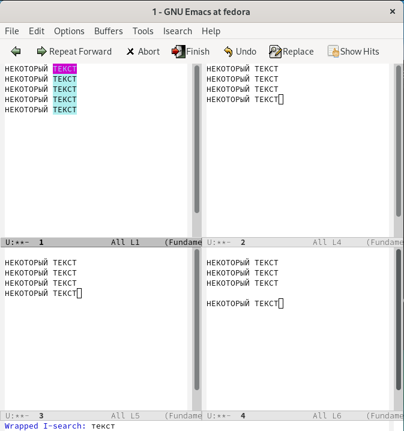{ #fig:026 width=70%}
	
	Вышли из режима поиска, нажав C-g. (рис. [-@fig:027])
	
	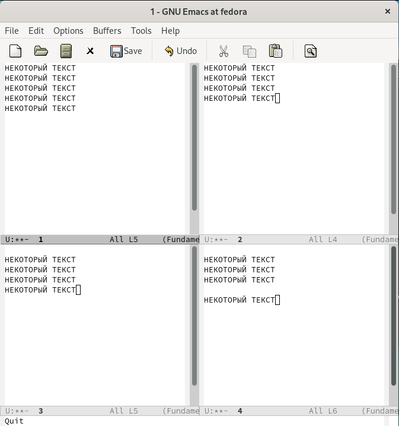{ #fig:027 width=70%}
	
	Перешли в режим поиска и замены (M-%), ввели текст, который следует найти
и заменить, нажали Enter , затем ввели текст для замены. После того как были
подсвечены результаты поиска, нажали ! для подтверждения замены.

	{ #fig:029 width=70%}
	
	Попробовали другой режим поиска, нажав M-s o. (рис. [-@fig:030])
	
	{ #fig:030 width=70%}

# Выводы

В ходе выполнения лабораторной работы ознакомились с операционной системой Linux. Получили практические навыки работы с редактором Emacs.

# Ответы на контрольные вопросы
1. Кратко охарактеризуйте редактор emacs.

	Emacs представляет собой мощный экранный редактор текста, написанный на языке
высокого уровня Elisp.

2. Какие особенности данного редактора могут сделать его сложным для освоения новичком?

	Для работы с Emacs можно использовать как элементы меню, так и различные сочетания клавиш.

3. Своими словами опишите, что такое буфер и окно в терминологии emacs’а.

	Буфер — объект, представляющий какой-либо текст.
	Окно — прямоугольная область фрейма, отображающая один из буферов.

4. Можно ли открыть больше 10 буферов в одном окне? (Нет)

5. Какие буферы создаются по умолчанию при запуске emacs?

	По умолчанию при открытии Emacs создает два буфера — scratch и Messages.

6. Какие клавиши вы нажмёте, чтобы ввести следующую комбинацию C-c | и C-c C-|?

	Ctr + c, Ctr + c Ctr + |

7. Как поделить текущее окно на две части? (Ctr + X)

8. В каком файле хранятся настройки редактора emacs?

	Настройки emacs хранятся в файле .emacs, который хранится в домашней дирректории пользователя. 

9. Какую функцию выполняет клавиша -> можно ли её переназначить? (Табуляция)

10. Какой редактор вам показался удобнее в работе vi или emacs? (vi)

