---
## Front matter
lang: ru-RU
title: Hugo
subtitle: Первый этап индивидуального проекта
author:
  - Петросян Э. М.
institute:
  - Российский университет дружбы народов, Москва, Россия
date: 25 февраля 2023

## i18n babel
babel-lang: russian
babel-otherlangs: english

## Formatting pdf
toc: false
toc-title: Содержание
slide_level: 2
aspectratio: 169
section-titles: true
theme: metropolis
header-includes:
 - \metroset{progressbar=frametitle,sectionpage=progressbar,numbering=fraction}
 - '\makeatletter'
 - '\beamer@ignorenonframefalse'
 - '\makeatother'
backgroundColor: orange
---

# Информация

## Докладчик

:::::::::::::: {.columns align=center}
::: {.column width="60%"}

  * Петросян Эмиль Манукович
  * студент 1 курса, группа НММбд-03-22
  * Российский университет дружбы народов

:::
::: {.column width="40%"}

:::
::::::::::::::

# Вводная часть

## Объект и предмет исследования

- Hugo
- Github pages

## Цель работы

- Научиться размещать на Github pages заготовки для персонального сайта.

## Задание
1. Установить необходимое программное обеспечение.
2. Скачать шаблон темы сайта.
3. Разместить его на хостинге git.
4. Установить параметр для URLs сайта.
5. Разместить заготовку сайта на Github pages.

# Выполнение первого этапа индивидуального проекта

## Установка программного обеспечения для Hugo

:::::::::::::: {.columns align=center}

::: {.column width="50%"}

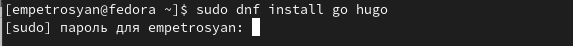

:::

::: {.column width="50%"}

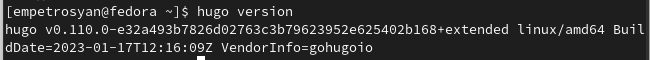

:::

::::::::::::::

## Скачивание шаблона темы сайта.

:::::::::::::: {.columns align=center}

::: {.column width="30%"}

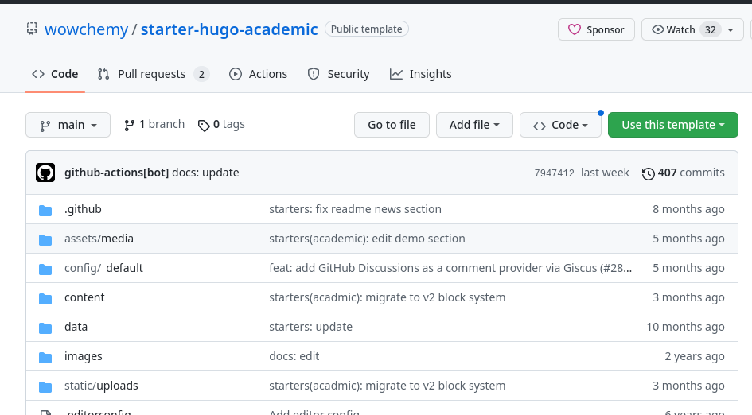

:::

::: {.column width="30%"}

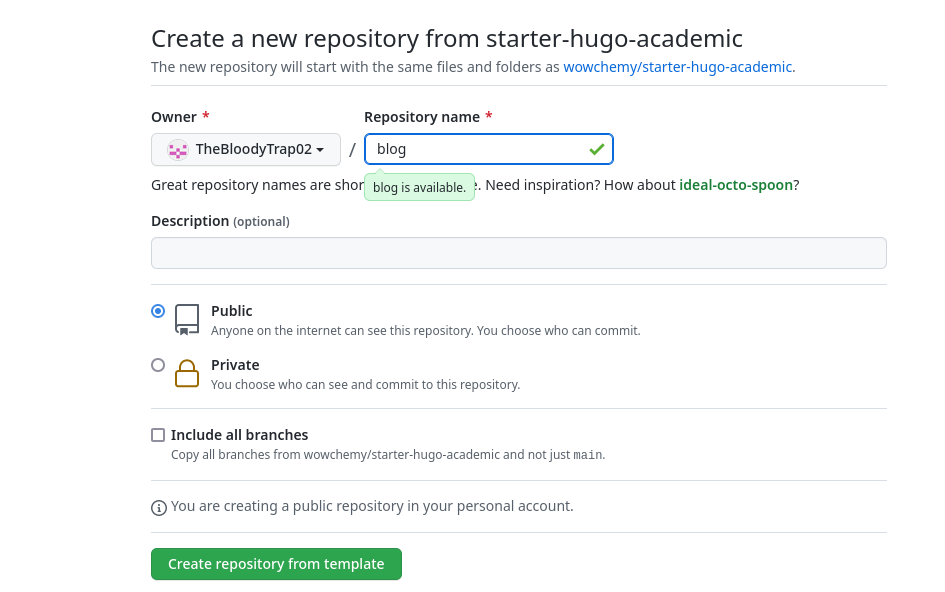

:::

::: {.column width="30%"}

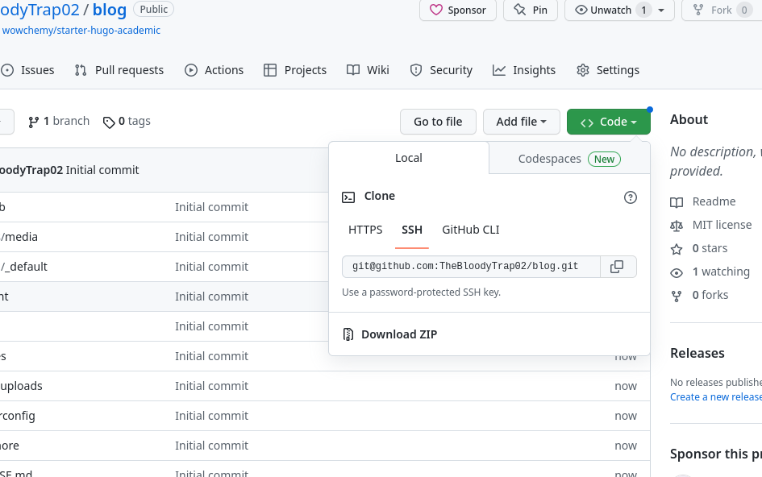

:::

::::::::::::::

## Размещение шаблона на хостинге git.

:::::::::::::: {.columns align=center}

::: {.column width="30%"}

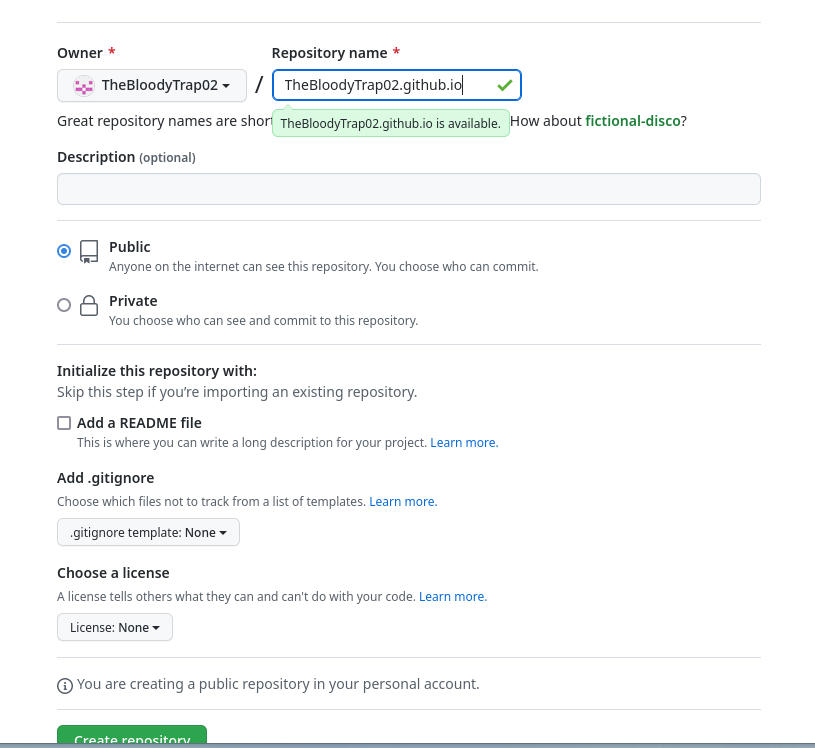

:::

::: {.column width="30%"}

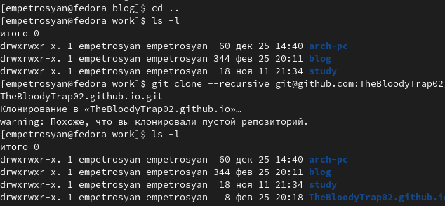

:::

::: {.column width="30%"}

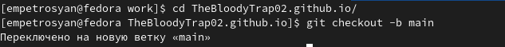

:::

::::::::::::::

## Установка параметра для URLs сайта.

:::::::::::::: {.columns align=center}

::: {.column width="30%"}

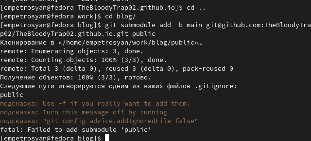

:::

::: {.column width="30%"}

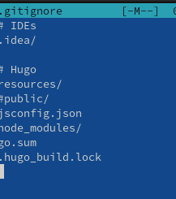

:::

::: {.column width="30%"}

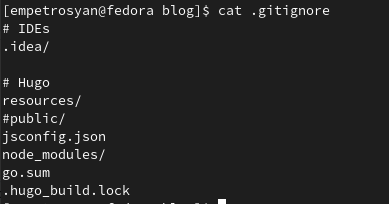

:::

::::::::::::::

## Размещение заготовки сайта на Github pages.

:::::::::::::: {.columns align=center}

::: {.column width="30%"}

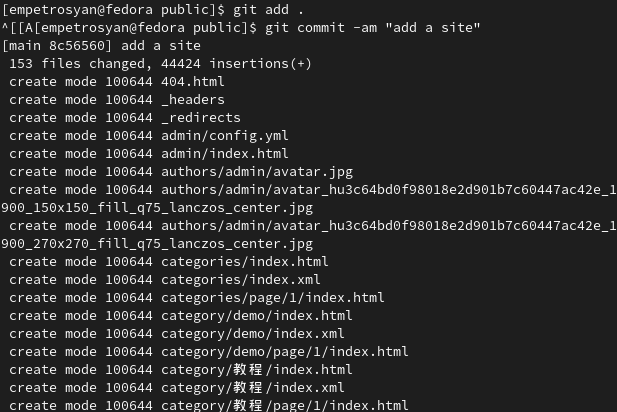

:::

::: {.column width="30%"}

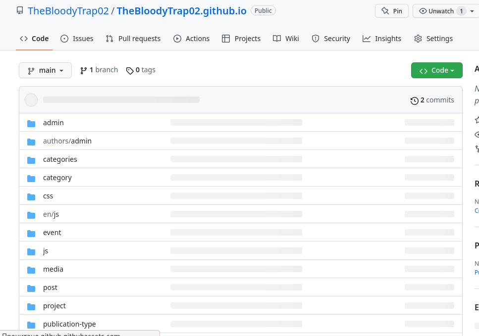

:::

::: {.column width="30%"}

:::

::::::::::::::

# Результаты

## Выводы из первого этапа индивидуального проекта

В ходе выполнения первого этапа индивидуального проекта были изучены способы размещения на Github pages заготовки для персонального сайта.

