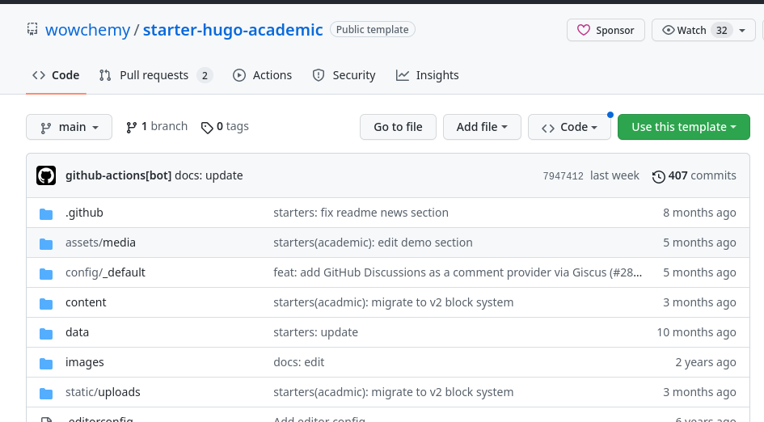

---
## Front matter
title: "Отчёт по первому этапу индивидуального проекта"
subtitle: "НММбд-03-22"
author: "Петросян Эмиль Манукович"

## Generic otions
lang: ru-RU
toc-title: "Содержание"

## Bibliography
bibliography: bib/cite.bib
csl: pandoc/csl/gost-r-7-0-5-2008-numeric.csl

## Pdf output format
toc: true # Table of contents
toc-depth: 2
lof: true # List of figures
fontsize: 12pt
linestretch: 1.5
papersize: a4
documentclass: scrreprt
## I18n polyglossia
polyglossia-lang:
  name: russian
  options:
	- spelling=modern
	- babelshorthands=true
polyglossia-otherlangs:
  name: english
## I18n babel
babel-lang: russian
babel-otherlangs: english
## Fonts
mainfont: PT Serif
romanfont: PT Serif
sansfont: PT Sans
monofont: PT Mono
mainfontoptions: Ligatures=TeX
romanfontoptions: Ligatures=TeX
sansfontoptions: Ligatures=TeX,Scale=MatchLowercase
monofontoptions: Scale=MatchLowercase,Scale=0.9
## Biblatex
biblatex: true
biblio-style: "gost-numeric"
biblatexoptions:
  - parentracker=true
  - backend=biber
  - hyperref=auto
  - language=auto
  - autolang=other*
  - citestyle=gost-numeric
## Pandoc-crossref LaTeX customization
figureTitle: "Рис."
tableTitle: "Таблица"
listingTitle: "Листинг"
lofTitle: "Список иллюстраций"
lolTitle: "Листинги"
## Misc options
indent: true
header-includes:
  - \usepackage{indentfirst}
  - \usepackage{float} # keep figures where there are in the text
  - \floatplacement{figure}{H} # keep figures where there are in the text
---

# Цель работы
- Научиться размещать на Github pages заготовки для персонального сайта.

# Задание
- Установить необходимое программное обеспечение.
- Скачать шаблон темы сайта.
- Разместить его на хостинге git.
- Установить параметр для URLs сайта.
- Разместить заготовку сайта на Github pages.

# Выполнение первого этапа индивидуального проекта

## Установка программного обеспечения для Hugo

Установили программное обеспечение для Hugo через консоль. Проверили версию.(рис. [-@fig:001]), (рис. [-@fig:002])

{ #fig:001 width=70%}

{ #fig:002 width=70%}

## Скачивание шаблона темы сайта.

Скопировали шаблон репозитория в Github. (рис. [-@fig:003]), (рис. [-@fig:004])

{ #fig:003 width=70%}

{ #fig:004 width=70%}

Клонировали репозиторий в рабочий каталог. (рис. [-@fig:005]), (рис. [-@fig:006])

{ #fig:005 width=70%}

{ #fig:006 width=70%}

Проверили правильность клонирования. (рис. [-@fig:007])

{ #fig:007 width=70%}

Запустили Hugo server (рис. [-@fig:008]), (рис. [-@fig:009])

{ #fig:008 width=70%}

{ #fig:009 width=70%}

Убрали синий демо-фон, отредактировав файл index.md (рис. [-@fig:010]), (рис. [-@fig:011]), (рис. [-@fig:012])

{ #fig:010 width=70%}

{ #fig:011 width=70%}

{ #fig:012 width=70%}

## Размещение шаблона на хостинге git.

Создали новый репозиторий Frostoslav.github.io (рис. [-@fig:013])

{ #fig:013 width=70%}

Клонировали его в рабочий каталог. (рис. [-@fig:014])

{ #fig:014 width=70%}

Создали ветку main. (рис. [-@fig:015])

{ #fig:015 width=70%}

Создали файл README.md (рис. [-@fig:016])

{ #fig:016 width=70%}

Обновили репозиторий на github, отправив внесённые изменения. (рис. [-@fig:017]), (рис. [-@fig:018])

{ #fig:017 width=70%}

{ #fig:018 width=70%}

## Установка параметра для URLs сайта.

Подключили репозиторий к папке public внутри каталога blog. Дя этого закомментировали public в файле .gitignore.
(рис. [-@fig:019]), (рис. [-@fig:020]), (рис. [-@fig:021]), (рис. [-@fig:022]), (рис. [-@fig:023])

{ #fig:019 width=70%}

{ #fig:020 width=70%}

{ #fig:021 width=70%}

{ #fig:022 width=70%}

{ #fig:023 width=70%}

## Размещение заготовки сайта на Github pages.

Использовали комманду Hugo. (рис. [-@fig:024])

{ #fig:024 width=70%}

В папке public появились файлы.(рис. [-@fig:025])

{ #fig:025 width=70%}

Проверили подключен ли репозиторий. (рис. [-@fig:026])

{ #fig:026 width=70%}

Добавили сайт в репозиторий на github. (рис. [-@fig:027]), (рис. [-@fig:028]), (рис. [-@fig:029])

{ #fig:027 width=70%}

{ #fig:028 width=70%}

{ #fig:029 width=70%}

Открыли страницу сайта. (рис. [-@fig:030])

{ #fig:030 width=70%}

# Выводы

В ходе выполнения первого этапа индивидуального проекта были изучены способы размещения на Github pages заготовки для персонального сайта.
	
	
