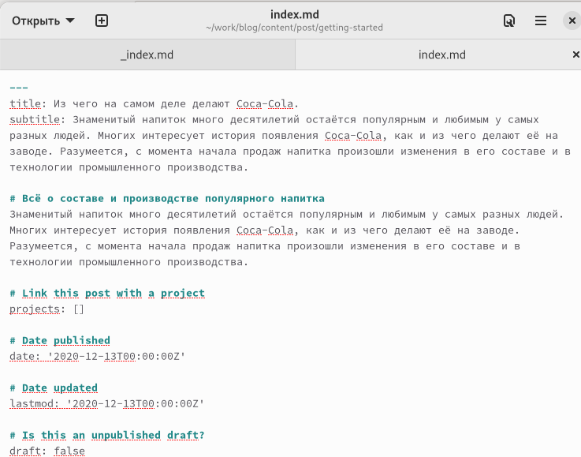

---
## Front matter
lang: ru-RU
title: Hugo
subtitle: Второй этап индивидуального проекта
author: Петросян Э. М. 
  - 
institute:
  - Российский университет дружбы народов, Москва, Россия
date: 18 марта 2023

## i18n babel
babel-lang: russian
babel-otherlangs: english

## Formatting pdf
toc: false
toc-title: Содержание
slide_level: 2
aspectratio: 169
section-titles: true
theme: metropolis
header-includes:
 - \metroset{progressbar=frametitle,sectionpage=progressbar,numbering=fraction}
 - '\makeatletter'
 - '\beamer@ignorenonframefalse'
 - '\makeatother'
backgroundColor: orange
---

# Информация

## Докладчик

:::::::::::::: {.columns align=center}
::: {.column width="60%"}

  * Петросян Эмиль Манукович
  * студент 1 курса, группа НММбд-03-22
  * Российский университет дружбы народов

:::
::: {.column width="40%"}

:::
::::::::::::::

# Вводная часть

## Объект и предмет исследования

- Hugo
- Github pages

## Цель работы

- Добавить к сайту данные о себе.

## Задание
- Разместить фотографию владельца сайта.
- Разместить краткое описание владельца сайта (Biography)
- Добавить информацию об интересах (Interests).
- Добавить информацию от образовании (Education).
- Сделать пост по прошедшей неделе.
- Добавить пост на тему по выбору:
- Управление версиями. Git.
- Непрерывная интеграция и непрерывное развертывание (CI/CD).

# Выполнение второго этапа индивидуального проекта

## Смена аватара

:::::::::::::: {.columns align=center}

::: {.column width="50%"}

:::

::: {.column width="50%"}

:::

::::::::::::::

## Описание владельца сайта

:::::::::::::: {.columns align=center}

::: {.column width="30%"}

:::

::: {.column width="30%"}

:::

::: {.column width="30%"}

:::

::::::::::::::

## Пост недели.

:::::::::::::: {.columns align=center}

::: {.column width="30%"}

:::

::: {.column width="30%"}

:::

::: {.column width="30%"}

:::

::::::::::::::

## Пост по выбору.

:::::::::::::: {.columns align=center}

::: {.column width="30%"}

:::

::: {.column width="30%"}

:::

::: {.column width="30%"}

:::

::::::::::::::

## Размещение шаблона на хостинге git.

:::::::::::::: {.columns align=center}

::: {.column width="95%"}

:::

::::::::::::::

# Результаты

## Выводы из первого этапа индивидуального проекта

В ходе выполнения первого этапа индивидуального проекта были изучены способы изменения информации на сайте и создания постов.

